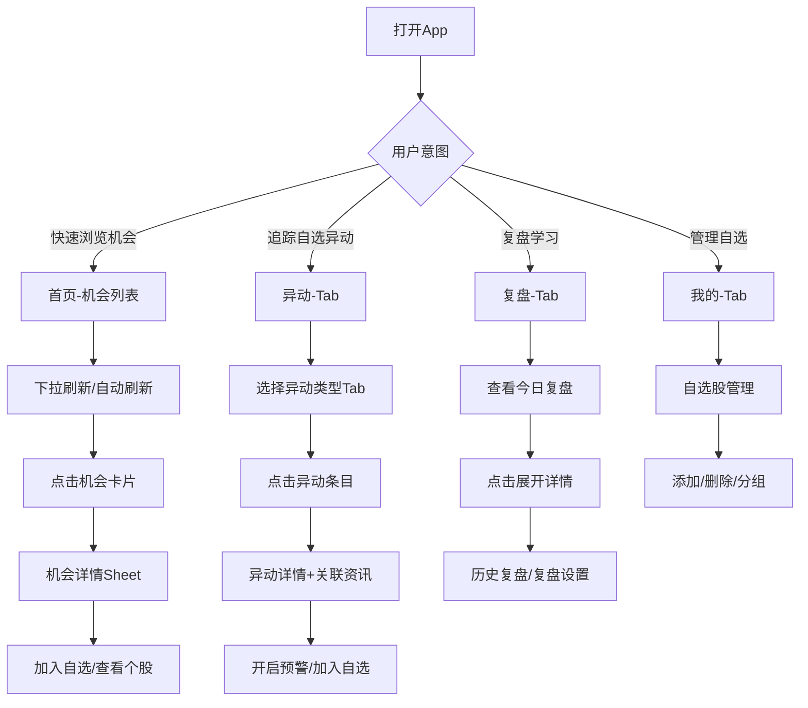

# 金融AI投资助手 - 产品需求文档（移动端MVP）

## 1. 产品概述

金融AI投资助手是一款面向个人投资者的移动端智能选股与市场分析工具，通过AI技术整合实时资讯与行情数据，帮助用户快速发现投资机会、追踪盘面异动、获取智能复盘。

- **核心价值**：解决个人投资者「信息过载、响应滞后、决策困难」三大痛点
- **目标用户**：有一定投资经验的个人投资者（日内交易者、波段操作者）
- **使用场景**：通勤、午休、收盘后复盘等碎片化时间

---

## 2. 核心功能

### 2.1 功能模块总览

| 模块名称 | 功能描述 | 优先级 |
|---------|---------|--------|
| 今日机会 | 基于实时资讯挖掘个股机会 | P0 |
| 异动情报 | 捕捉盘面异动并关联资讯 | P0 |
| 智能复盘 | AI生成市场复盘报告 | P0 |
| 自选管理 | 用户自选股管理与跟踪 | P1 |

### 2.2 页面结构

```
├── 首页（Tab: 机会）
│   ├── 机会卡片列表
│   ├── 搜索入口
│   └── 筛选器
├── 异动（Tab: 异动）
│   ├── 异动列表（价格/资金/成交量）
│   ├── 异动详情（含关联资讯）
│   └── 预警订阅
├── 复盘（Tab: 复盘）
│   ├── 今日复盘报告
│   ├── 历史复盘
│   └── 复盘设置
└── 我的（Tab: 我的）
    ├── 自选股管理
    ├── 预警订阅
    └── 设置
```

---

## 3. 功能详情

### 3.1 首页 - 今日机会

#### 3.1.1 机会卡片列表

**数据来源**：
- AI实时扫描财经资讯（新浪财经、同花顺、东方财富等）
- 匹配资讯关联的个股
- 综合评分排序

**卡片信息**：
| 字段 | 说明 |
|-----|------|
| 题材名称 | 资讯涉及的核心题材/概念 |
| 关联个股 | 相关度最高的3-5只股票 |
| 消息来源 | 资讯来源媒体 + 时间 |
| 热度指数 | 0-100，反映题材当前热度 |
| 综合评分 | AI综合评估机会价值（1-5星）|

**交互设计**：
- 下拉刷新：手动刷新最新机会
- 自动刷新：每5分钟静默更新
- 点击卡片：展开详情Sheet
- 长按卡片：快捷操作（加入自选/分享）

#### 3.1.2 智能概念搜索

**功能入口**：首页顶部搜索框

**交互流程**：
1. 用户输入题材关键词（如「AI芯片」「新能源汽车」）
2. AI返回：
   - 关联概念板块列表
   - 成分股列表（股票代码、名称、相关性）
   - 相关衍生概念（延伸挖掘）
3. 点击个股：查看个股详情或加入自选

**技术要点**：
- 支持同义词扩展（锂电池 ↔ 动力电池 ↔ 锂电）
- 支持模糊匹配
- 搜索历史记录

#### 3.1.3 机会详情页

**内容结构**：
```
┌─────────────────────────────────────┐
│ 题材：AI芯片                         │
│ 热度指数：85                         │
│ 更新时间：10分钟前                   │
├─────────────────────────────────────┤
│ 📌 题材概述                          │
│ AI芯片行业近期受益于...（AI生成）    │
├─────────────────────────────────────┤
│ 🚀 驱动逻辑                          │
│ 1. xxx                               │
│ 2. xxx                               │
│ 3. xxx                               │
├─────────────────────────────────────┤
│ 📈 关联个股                          │
│ ┌────┬─────┬───────┬──────┐         │
│ │代码│名称 │相关性 │今日表现│        │
│ ├────┼─────┼───────┼──────┤         │
│ │XXX │XXX  │ 0.95  │+5.2% │         │
│ └────┴─────┴───────┴──────┘         │
├─────────────────────────────────────┤
│ 📰 相关资讯                          │
│ • [10:30] xxx消息...                │
│ • [09:45] xxx分析...                │
├─────────────────────────────────────┤
│ 💡 AI参考建议                        │
│ 建议关注...（非荐股，仅供参考）      │
├─────────────────────────────────────┤
│ [加入自选]  [查看详情]               │
└─────────────────────────────────────┘
```

---

### 3.2 异动情报

#### 3.2.1 异动监控列表

**异动类型**：
| 类型 | 触发条件 |
|-----|---------|
| 价格异动 | 涨跌幅超过5% |
| 资金异动 | 大单净流入/流出超过5000万 |
| 成交量异动 | 量比超过3 |
| 板块异动 | 板块整体涨跌幅超过3% |

**列表展示**：
| 字段 | 说明 |
|-----|------|
| 股票名称 | 异动个股 |
| 异动类型 | 价格/资金/成交量/板块 |
| 异动幅度 | 具体数值（如+8.2%）|
| 异动时间 | HH:MM:SS |
| 关联资讯 | 数量（0-N条）|

**交互设计**：
- Tab切换：全部 / 价格 / 资金 / 成交量
- 筛选：时间范围、自选股专属
- 点击条目：展开详情（含关联资讯）

#### 3.2.2 异动详情 + 资讯联动

**展示结构**：
```
┌─────────────────────────────────────┐
│ XXX（涨幅 +8.2%）                   │
│ 异动时间：14:32:15                  │
│ 异动类型：价格异动                   │
├─────────────────────────────────────┤
│ 📰 关联资讯（3条）                   │
│ ┌─────────────────────────────────┐ │
│ │ [14:30] XXX公司发布XX公告        │ │
│ │ 关键段落：高算力芯片需求大增...   │ │
│ └─────────────────────────────────┘ │
│ • [14:28] 行业传来XX消息            │
│ • [14:25] 机构上调XX评级            │
├─────────────────────────────────────┤
│ ⚠️ 无消息催化                        │
│ 此异动暂无关联资讯，纯盘面行为       │
├─────────────────────────────────────┤
│ 💡 AI解读                           │
│ 异动或因...建议关注后续走势...       │
├─────────────────────────────────────┤
│ [加入自选]  [查看K线]               │
└─────────────────────────────────────┘
```

#### 3.2.3 预警订阅

**订阅维度**：
- 特定个股
- 特定板块
- 特定异动类型

**通知方式**：站内推送

**阈值配置**：
- 涨跌幅阈值（默认5%）
- 资金量阈值（默认5000万）
- 通知时间段（默认9:30-15:00）

---

### 3.3 智能复盘

#### 3.3.1 今日复盘报告

**生成时机**：每日收盘后自动生成（A股 15:30后）

**报告结构**：
```
┌─────────────────────────────────────┐
│ 📊 今日市场总览                      │
├─────────────────────────────────────┤
│ 上证指数    深证成指    创业板指    │
│ +1.2%       -0.5%       +2.3%       │
│                                    │
│ 成交量：XXX亿  北向资金：+XX亿       │
│ 涨停：85家    跌停：12家            │
├─────────────────────────────────────┤
│ 🔥 今日热点                         │
│ ┌─────────────────────────────────┐ │
│ │ 1. AI芯片板块 (+5.2%)           │ │
│ │    驱动：英伟达业绩超预期...     │ │
│ │    龙头：XXX、XXX               │ │
│ └─────────────────────────────────┘ │
│ • 新能源汽车 (+3.1%)                │
│ • 医药板块 (-1.2%)                  │
├─────────────────────────────────────┤
│ 💡 明日展望                         │
│ • 潜在机会：...                     │
│ • 风险提示：...                     │
├─────────────────────────────────────┤
│ 📋 持仓复盘（自选股今日表现）        │
│ XXX：+5.2%  AI点评：...             │
│ XXX：-2.1%  AI点评：...             │
└─────────────────────────────────────┘
```

#### 3.3.2 历史复盘

- 日期选择器：查看历史复盘
- 搜索：按关键词搜索复盘内容
- 分享：一键分享到微信/雪球

#### 3.3.3 复盘设置

**个性化定制**：
- 关注板块：勾选关注的行业板块
- 复盘深度：简洁版 / 标准版 / 详细版
- 推送时间：收盘后立即推送 / 20:00推送 / 次日推送

---

### 3.4 我的（个人中心）

#### 3.4.1 自选股管理

- 自选股列表：支持搜索添加、批量管理
- 自选股分组：自定义分组（如「短线」「长线」）
- 自选股行情：实时价格、涨跌幅

#### 3.4.2 预警订阅管理

- 查看/编辑已订阅的预警
- 预警历史记录

#### 3.4.3 设置

- 复盘推送时间
- 异动预警开关
- 通知声音
- 深色/浅色模式

---

## 4. 用户交互流程

### 4.1 主要流程图



### 4.2 关键用户路径

**路径1：发现投资机会**
1. 用户打开App → 首页机会列表
2. 浏览机会卡片 → 关注高评分机会
3. 点击卡片 → 查看详情
4. 阅读驱动逻辑 + 关联个股
5. 决定是否加入自选或查看K线

**路径2：追踪盘面异动**
1. 用户打开异动Tab → 查看异动列表
2. 切换价格/资金/成交量Tab
3. 点击异动条目 → 查看关联资讯
4. 如有资讯 → 判断异动原因
5. 如无资讯 → 关注纯盘面异动
6. 开启预警订阅

**路径3：每日复盘学习**
1. 收盘后收到推送 → 打开复盘Tab
2. 阅读今日市场总览 → 了解大盘表现
3. 查看今日热点 → 学习龙头个股
4. 阅读明日展望 → 制定次日计划
5. 查看持仓复盘 → 反思持仓决策

---

## 5. UI/UX设计规范

### 5.1 设计风格

**视觉定位**：金融科技感 + 专业可信 + 简洁高效

**设计关键词**：数据驱动、层次分明、行动导向

### 5.2 色彩规范

| 用途 | 颜色 | 色值 |
|-----|------|-----|
| 主色 | 深蓝 | #1A365D |
| 次色 | 科技蓝 | #3182CE |
| 强调色 | 金色 | #D69E2E |
| 上涨色 | 红色 | #E53E3E |
| 下跌色 | 绿色 | #38A169 |
| 背景色 | 深灰 | #1A1A2E |
| 卡片背景 | 深灰 | #16213E |
| 文字主色 | 白色 | #FFFFFF |
| 文字次色 | 浅灰 | #A0AEC0 |

### 5.3 字体规范

| 用途 | 字体 | 大小 |
|-----|------|-----|
| 标题 | PingFang SC Bold | 18-24px |
| 正文 | PingFang SC Regular | 14-16px |
| 数据 | DIN Alternate Bold | 16-20px |
| 辅助 | PingFang SC Light | 12px |

### 5.4 布局规范

- **底部Tab导航**：4个Tab（机会/异动/复盘/我的）
- **卡片式设计**：信息以卡片形式呈现，圆角12px
- **安全区域**：适配iPhone刘海屏，底部留出Home Indicator空间
- **触控区域**：最小点击区域44x44px

### 5.5 动效规范

| 动效类型 | 时长 | 缓动函数 |
|---------|------|---------|
| 页面切换 | 300ms | ease-in-out |
| 卡片展开 | 250ms | ease-out |
| 刷新动画 | 1000ms | linear |
| 数字跳动 | 150ms | ease-out |

### 5.6 页面原型说明

**首页-机会列表**
- 顶部：搜索框 + 筛选入口
- 中部：机会卡片列表（下拉刷新）
- 底部：Tab导航

**机会详情Sheet**
- 从底部滑出的半屏Sheet
- 支持拖拽展开为全屏

**异动Tab**
- 顶部：异动类型Tab（全部/价格/资金/成交量）
- 中部：异动列表
- 底部：Tab导航

**复盘Tab**
- 顶部：日期选择 + 分享按钮
- 内容：折叠式长页面
- 分段阅读，支持点击展开详情

**我的Tab**
- 列表式布局
- 头像、昵称、设置入口

---

## 6. 非功能性需求

| 维度 | 要求 |
|-----|------|
| **性能** | 列表渲染 < 100ms；详情加载 < 500ms |
| **响应** | 资讯延迟 ≤ 1分钟；异动响应 ≤ 3秒 |
| **离线** | 缓存最近24小时数据；弱网提示 |
| **安全** | HTTPS传输；敏感数据加密 |
| **适配** | iOS 12+；Android 8+ |

---

## 7. MVP范围

### 7.1 第一版上线功能

| 功能 | 说明 |
|-----|------|
| 今日机会列表 | 展示机会卡片，支持下拉刷新 |
| 机会详情 | 展示驱动逻辑、关联个股、相关资讯 |
| 概念搜索 | 支持关键词搜索，返回关联个股 |
| 异动列表 | 展示价格/资金异动 |
| 异动详情 | 展示异动+关联资讯 |
| 今日复盘 | 展示复盘报告 |
| 自选管理 | 添加/删除自选股 |
| Tab导航 | 底部4Tab导航 |

### 7.2 第二版功能（后续迭代）

- 预警订阅推送
- 历史复盘回溯
- 复盘个性化设置
- 自选股分组管理

---

## 8. 数据说明

### 8.1 模拟数据

由于MVP阶段无真实数据接口，将使用模拟数据：

| 数据类型 | 模拟方式 |
|---------|---------|
| 机会数据 | 预设10-20条典型机会 |
| 异动数据 | 预设异动列表，支持模拟刷新 |
| 复盘数据 | 预设完整复盘模板 |
| 股票行情 | 模拟实时价格波动 |

### 8.2 数据结构

**机会卡片**
```typescript
interface Opportunity {
  id: string;
  topic: string;
  topicDescription: string;
  heatIndex: number; // 0-100
  score: number; // 1-5星
  stocks: Stock[];
  news: News[];
  drivers: string[];
  updatedAt: string;
}
```

**异动条目**
```typescript
interface Anomaly {
  id: string;
  stockName: string;
  stockCode: string;
  type: 'price' | 'fund' | 'volume';
  change: number;
  time: string;
  newsCount: number;
  news: News[];
  aiInsight: string;
  hasNews: boolean;
}
```

**复盘报告**
```typescript
interface ReviewReport {
  date: string;
  indices: IndexData[];
  hotSectors: Sector[];
  outlook: {
    opportunities: string[];
    risks: string[];
  };
  portfolio: PortfolioItem[];
}
```
