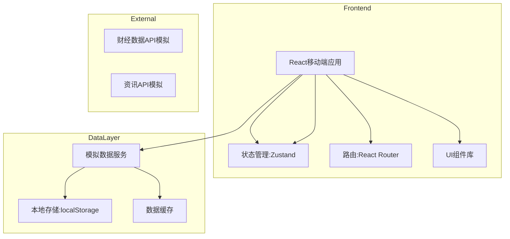

# 金融AI投资助手 - 技术架构文档（移动端MVP）

## 1. 架构设计



## 2. 技术选型

| 类别 | 技术栈 | 版本 |
|-----|-------|------|
| 框架 | React | 18.x |
| 构建工具 | Vite | 5.x |
| 路由 | React Router | 6.x |
| 状态管理 | Zustand | 4.x |
| 样式方案 | Tailwind CSS | 3.x |
| 动画 | Framer Motion | 11.x |
| 图标 | Lucide React | 最新 |
| 日期处理 | Day.js | 1.x |

## 3. 目录结构

```
/workspace
├── index.html
├── package.json
├── vite.config.js
├── tailwind.config.js
├── postcss.config.js
├── src/
│   ├── main.jsx
│   ├── App.jsx
│   ├── index.css
│   ├── components/
│   │   ├── layout/
│   │   │   ├── TabBar.jsx
│   │   │   └── Header.jsx
│   │   ├── opportunity/
│   │   │   ├── OpportunityCard.jsx
│   │   │   ├── OpportunityDetail.jsx
│   │   │   └── SearchBar.jsx
│   │   ├── anomaly/
│   │   │   ├── AnomalyCard.jsx
│   │   │   ├── AnomalyDetail.jsx
│   │   │   └── AnomalyTabs.jsx
│   │   ├── review/
│   │   │   ├── ReviewReport.jsx
│   │   │   └── ReviewSection.jsx
│   │   └── common/
│   │       ├── StockItem.jsx
│   │       ├── NewsItem.jsx
│   │       └── StockBadge.jsx
│   ├── pages/
│   │   ├── HomePage.jsx
│   │   ├── AnomalyPage.jsx
│   │   ├── ReviewPage.jsx
│   │   └── ProfilePage.jsx
│   ├── stores/
│   │   ├── useAppStore.js
│   │   └── useStockStore.js
│   ├── services/
│   │   ├── mockData.js
│   │   └── dataService.js
│   ├── hooks/
│   │   ├── useRefresh.js
│   │   └── useInfiniteScroll.js
│   └── utils/
│       ├── format.js
│       └── constants.js
└── public/
    └── favicon.ico
```

## 4. 路由定义

| 路由 | 页面 | Tab对应 |
|-----|------|--------|
| / | 首页-机会列表 | 机会 |
| /anomaly | 异动情报 | 异动 |
| /review | 智能复盘 | 复盘 |
| /profile | 个人中心 | 我的 |

## 5. 数据模型

### 5.1 机会数据

```typescript
interface Opportunity {
  id: string;
  topic: string;
  topicDescription: string;
  heatIndex: number; // 0-100
  score: number; // 1-5
  stocks: Stock[];
  news: News[];
  drivers: string[];
  updatedAt: string;
}

interface Stock {
  code: string;
  name: string;
  change: number;
 相关性: number;
}

interface News {
  id: string;
  title: string;
  source: string;
  time: string;
  summary: string;
}
```

### 5.2 异动数据

```typescript
interface Anomaly {
  id: string;
  stockName: string;
  stockCode: string;
  type: 'price' | 'fund' | 'volume';
  change: number;
  time: string;
  newsCount: number;
  news: News[];
  aiInsight: string;
  hasNews: boolean;
}
```

### 5.3 复盘数据

```typescript
interface ReviewReport {
  date: string;
  indices: IndexData[];
  hotSectors: Sector[];
  outlook: {
    opportunities: string[];
    risks: string[];
  };
  portfolio: PortfolioItem[];
}

interface IndexData {
  name: string;
  value: number;
  change: number;
}

interface Sector {
  name: string;
  change: number;
  driver: string;
  leaders: string[];
}

interface PortfolioItem {
  stockName: string;
  stockCode: string;
  change: number;
  comment: string;
}
```

## 6. 组件设计

### 6.1 布局组件

| 组件 | 说明 |
|-----|------|
| TabBar | 底部Tab导航，4个Tab项 |
| Header | 页面顶部，包含标题、搜索入口 |

### 6.2 机会模块组件

| 组件 | 说明 |
|-----|------|
| OpportunityCard | 机会卡片，展示题材、个股、热度 |
| OpportunityDetail | 机会详情Sheet |
| SearchBar | 概念搜索输入框 |

### 6.3 异动模块组件

| 组件 | 说明 |
|-----|------|
| AnomalyCard | 异动卡片，展示个股、异动类型 |
| AnomalyDetail | 异动详情Sheet，含关联资讯 |
| AnomalyTabs | 异动类型Tab切换 |

### 6.4 复盘模块组件

| 组件 | 说明 |
|-----|------|
| ReviewReport | 复盘报告主组件 |
| ReviewSection | 复盘内容分段组件 |

### 6.5 通用组件

| 组件 | 说明 |
|-----|------|
| StockItem | 股票列表项 |
| NewsItem | 资讯列表项 |
| StockBadge | 股票代码/名称标签 |

## 7. 状态管理

使用Zustand进行状态管理：

```typescript
// 全局应用状态
interface AppState {
  // 当前Tab
  activeTab: string;
  setActiveTab: (tab) => void;
  
  // 自选股
  watchList: string[];
  addToWatchList: (code) => void;
  removeFromWatchList: (code) => void;
  
  // 预警订阅
  subscriptions: Subscription[];
  addSubscription: (sub) => void;
  removeSubscription: (id) => void;
}
```

## 8. 模拟数据服务

### 8.1 数据初始化

- 应用启动时加载预设模拟数据
- 使用setTimeout模拟异步请求
- 数据缓存至localStorage

### 8.2 数据刷新机制

- 机会列表：每5分钟自动刷新
- 异动列表：每30秒自动刷新
- 支持手动下拉刷新

## 9. 移动端适配

### 9.1 视口设置

```html
<meta name="viewport" content="width=device-width, initial-scale=1.0, maximum-scale=1.0, user-scalable=no, viewport-fit=cover">
```

### 9.2 安全区域

```css
padding-bottom: env(safe-area-inset-bottom);
padding-top: env(safe-area-inset-top);
```

### 9.3 触控优化

- 最小触控区域：44x44px
- 按钮间距：至少8px
- 手势支持：下拉刷新、上拉加载

## 10. 性能优化

| 优化项 | 方案 |
|-----|------|
| 首屏加载 | 骨架屏 + 懒加载 |
| 列表渲染 | 虚拟滚动（数据量大时）|
| 图片 | 使用CSS渐变代替图片 |
| 动画 | 使用transform/opacity |
| 缓存 | localStorage缓存数据 |

## 11. 开发规范

- 组件采用函数式组件 + Hooks
- 样式使用Tailwind CSS原子化方案
- 颜色使用CSS变量定义
- 动画优先使用CSS，复杂动效使用Framer Motion
- 模拟数据独立封装，便于后续替换真实API
